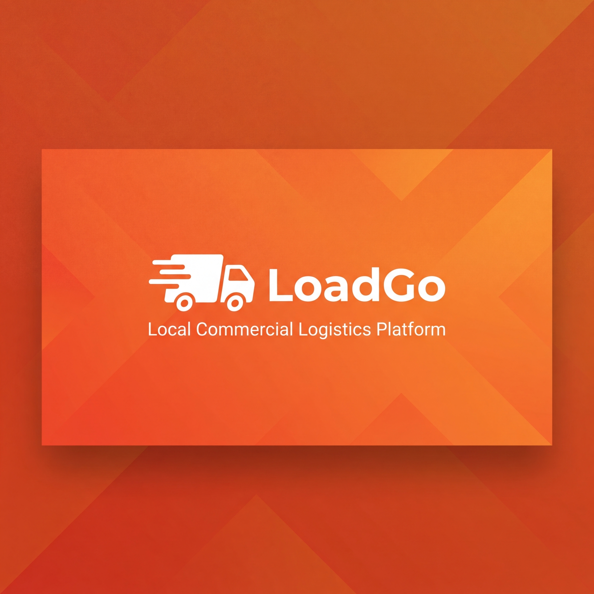
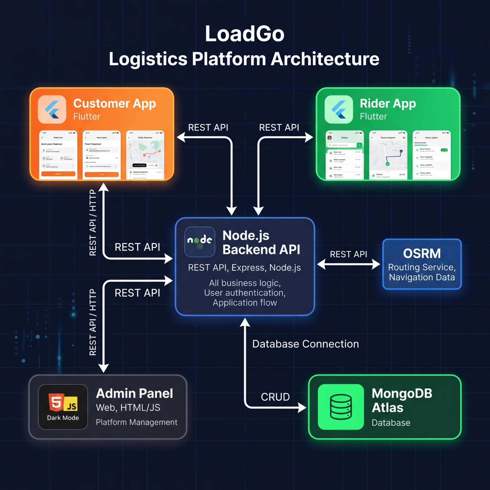

<p align="center">
  
</p>

<h1 align="center">🚛 LoadGo - Local Commercial Logistics Platform</h1>

<p align="center">
  <em>City-level transportation platform connecting local businesses with nearby transport vehicles for same-day delivery</em>
</p>

<p align="center">
  
  
  
  
</p>

---

## 📋 Table of Contents

- [About](#-about)
- [Features](#-features)
- [System Architecture](#-system-architecture)
- [Tech Stack](#-tech-stack)
- [Project Structure](#-project-structure)
- [API Documentation](#-api-documentation)
- [Getting Started](#-getting-started)
- [Deployment on Render](#-deployment-on-render)
- [Screenshots](#-screenshots)
- [Developer](#-developer)
- [License](#-license)

---

## 📖 About

**LoadGo** is a local commercial logistics platform designed for **city-level transportation within 15–20 km range** in Guwahati, India. 

While existing services like Uber/Rapido mainly support small parcels (~5 kg), local businesses such as **wholesalers, hardware shops, garment suppliers, and retailers** frequently need to send **medium and bulk goods** within the city. LoadGo fills this gap by connecting businesses with nearby transport vehicles (**pickup vans, mini trucks, loaders**) for same-day delivery.

### 🎯 Problem Statement

There is a clear gap in Guwahati for a dedicated system that:
- Connects businesses with **nearby transport vehicles**
- Supports **medium to bulk goods** (5-500+ kg)
- Provides **real-time tracking** with road-based routing
- Enables **same-day delivery** within city limits

---

## ✨ Features

### 📱 Customer App (Flutter)
| Feature | Description |
|---------|-------------|
| 🔐 Authentication | Phone + Email registration & login with JWT |
| 📍 Location Picker | Interactive OpenStreetMap-based location selection |
| 🚗 Vehicle Selection | Choose from 7+ vehicle types (Auto, Pickup, Mini Truck, etc.) |
| 💰 Dynamic Pricing | Real-time fare estimation based on distance & vehicle |
| 📦 Order Management | Create, track, cancel, and rate orders |
| 🗺️ Live Tracking | Real-time driver location on map with road routes (OSRM) |
| 📞 Driver Contact | Call driver directly from tracking screen |
| 📋 Order History | View all past and active orders |
| 📍 Saved Addresses | Save frequently used pickup/drop locations |
| ❓ Help & Support | FAQ section with call/email support |
| 🔒 Privacy Policy | Comprehensive data privacy information |
| ℹ️ About Page | App information & developer credits |

### 🏍️ Rider/Driver App (Flutter)
| Feature | Description |
|---------|-------------|
| 🟢 Online/Offline Toggle | Control availability to receive orders |
| 📡 GPS Location Updates | Auto-sends location every 15 seconds |
| 📦 Available Orders | See nearby orders within configurable radius |
| ✅ Order Accept/Reject | Accept or reject incoming delivery requests |
| 🔑 OTP Verification | Verify pickup with 4-digit OTP |
| 📊 Status Updates | Update order: Picked Up → In Transit → Delivered |
| 📞 Customer Contact | Call customer/sender/receiver directly |
| 💰 Earnings Dashboard | Track total earnings, trips, and per-trip average |
| 🗺️ Road Navigation | OSRM-based real road routing to pickup/dropoff |
| 🔔 Notifications | System announcements and order alerts |
| 📜 Trip History | Complete history of all completed/cancelled trips |

### 🖥️ Admin Panel (Web)
| Feature | Description |
|---------|-------------|
| 📊 Dashboard | Real-time stats: orders, revenue, users, drivers |
| 📦 Order Management | View all orders, filter by status, update status |
| 🚛 Driver Management | View/verify/activate/deactivate drivers |
| 👥 Customer Management | View all registered customers |
| ⚙️ Settings | Configure order radius (1-50 km), platform fee, max orders/driver |

### 🔧 Backend API (Node.js + Express)
| Feature | Description |
|---------|-------------|
| 🔐 JWT Authentication | Separate auth for Customers, Drivers, and Admins |
| 📍 Location-Based Filtering | Haversine distance formula for radius-based order filtering |
| 🗺️ OSRM Routing | Real road-based routes via OpenStreetMap Routing Machine |
| 🧮 TSP Optimization | Nearest-Neighbor + 2-opt heuristic for multi-stop route optimization |
| 💰 Dynamic Pricing | Distance-based pricing with base fare + per-km charges |
| ⚙️ Configurable Settings | Admin-adjustable system parameters stored in MongoDB |

---

## 🏗️ System Architecture

<p align="center">
  
</p>

```
┌──────────────────┐     ┌──────────────────┐
│  Customer App    │     │   Rider App      │
│  (Flutter)       │     │   (Flutter)      │
│  🟠 Port: Mobile │     │   🟢 Port: Mobile│
└────────┬─────────┘     └────────┬─────────┘
         │     REST API (JSON)    │
         │    ┌───────────┐       │
         └────┤           ├───────┘
              │  Backend  │
              │  Node.js  ├──────── OSRM Routing API
              │  Express  │         (router.project-osrm.org)
              │  :3000    │
         ┌────┤           ├───────┐
         │    └───────────┘       │
         │                        │
┌────────┴─────────┐     ┌───────┴──────────┐
│  Admin Panel     │     │  MongoDB Atlas   │
│  (HTML/JS/CSS)   │     │  (Cloud DB)      │
│  /admin          │     │  🟢 Cluster0     │
└──────────────────┘     └──────────────────┘
```

---

## 🛠️ Tech Stack

| Layer | Technology |
|-------|-----------|
| **Mobile Apps** | Flutter 3.x, Dart, Provider State Management |
| **Backend** | Node.js, Express.js 4.x |
| **Database** | MongoDB Atlas (Cloud) |
| **Authentication** | JWT (JSON Web Tokens) |
| **Maps** | OpenStreetMap + Nominatim Geocoding |
| **Routing** | OSRM (OpenStreetMap Routing Machine) |
| **Deployment** | Render (Backend), MongoDB Atlas (Database) |
| **Admin Panel** | Vanilla HTML5, CSS3, JavaScript |

### Key Libraries

**Backend:**
- `mongoose` — MongoDB ODM
- `bcryptjs` — Password hashing
- `jsonwebtoken` — JWT authentication
- `cors` — Cross-origin resource sharing
- `express-validator` — Input validation

**Flutter Apps:**
- `provider` — State management
- `flutter_map` + `latlong2` — OpenStreetMap maps
- `geolocator` — GPS location services
- `google_fonts` — Typography (Inter, Poppins)
- `flutter_animate` — Smooth animations
- `url_launcher` — Phone call integration
- `shared_preferences` — Local storage

---

## 📁 Project Structure

```
loadgo/
├── 📁 backend/                    # Node.js Express API Server
│   ├── 📁 config/
│   │   └── db.js                  # MongoDB connection
│   ├── 📁 controllers/
│   │   ├── authController.js      # Customer auth (register, login, profile)
│   │   ├── driverController.js    # Driver operations + Haversine filtering
│   │   ├── orderController.js     # Order CRUD + tracking
│   │   ├── adminController.js     # Admin dashboard + config management
│   │   └── pricingController.js   # Dynamic price calculation
│   ├── 📁 middleware/
│   │   ├── auth.js                # Customer JWT middleware
│   │   ├── driverAuth.js          # Driver JWT middleware
│   │   ├── adminAuth.js           # Admin JWT middleware
│   │   └── errorHandler.js        # Global error handler
│   ├── 📁 models/
│   │   ├── User.js                # Customer schema
│   │   ├── Driver.js              # Driver schema with location
│   │   ├── Order.js               # Order schema with status history
│   │   ├── Vehicle.js             # Vehicle type schema
│   │   ├── Admin.js               # Admin schema
│   │   └── Config.js              # System configuration schema
│   ├── 📁 routes/
│   │   ├── auth.js                # /api/auth/*
│   │   ├── drivers.js             # /api/drivers/*
│   │   ├── orders.js              # /api/orders/*
│   │   ├── vehicles.js            # /api/vehicles/*
│   │   ├── pricing.js             # /api/pricing/*
│   │   ├── routing.js             # /api/routing/* (OSRM + TSP)
│   │   └── admin.js               # /api/admin/*
│   ├── 📁 seed/
│   │   ├── seedVehicles.js        # Seed 7 vehicle types
│   │   ├── seedAdmin.js           # Seed admin account
│   │   └── seedConfig.js          # Seed default configurations
│   ├── .env.example               # Environment variables template
│   ├── package.json
│   └── server.js                  # App entry point
│
├── 📁 customer_app/               # Flutter Customer Application
│   └── lib/
│       ├── 📁 config/
│       │   ├── api_config.dart    # API endpoints
│       │   └── theme.dart         # App theme (Orange)
│       ├── 📁 models/
│       │   ├── order_model.dart   # Order + Driver info models
│       │   └── vehicle_model.dart # Vehicle type model
│       ├── 📁 providers/
│       │   ├── auth_provider.dart  # Authentication state
│       │   └── order_provider.dart # Order management state
│       ├── 📁 screens/
│       │   ├── splash_screen.dart
│       │   ├── onboarding_screen.dart
│       │   ├── login_screen.dart
│       │   ├── register_screen.dart
│       │   ├── home_screen.dart
│       │   ├── select_location_screen.dart
│       │   ├── booking_details_screen.dart
│       │   ├── price_summary_screen.dart
│       │   ├── order_tracking_screen.dart
│       │   ├── profile_screen.dart
│       │   ├── saved_addresses_screen.dart
│       │   ├── help_support_screen.dart
│       │   ├── about_screen.dart
│       │   └── privacy_policy_screen.dart
│       ├── 📁 services/
│       │   └── api_service.dart   # HTTP client wrapper
│       └── main.dart
│
├── 📁 rider_app/                  # Flutter Driver Application
│   └── lib/
│       ├── 📁 config/
│       │   ├── api_config.dart
│       │   └── theme.dart         # App theme (Green)
│       ├── 📁 models/
│       │   ├── order_model.dart
│       │   └── driver_model.dart
│       ├── 📁 providers/
│       │   ├── driver_auth_provider.dart
│       │   └── ride_provider.dart
│       ├── 📁 screens/
│       │   ├── splash_screen.dart
│       │   ├── login_screen.dart
│       │   ├── register_screen.dart
│       │   ├── home_screen.dart
│       │   ├── order_detail_screen.dart
│       │   ├── earnings_screen.dart
│       │   ├── notifications_screen.dart
│       │   ├── help_support_screen.dart
│       │   └── about_screen.dart
│       ├── 📁 services/
│       │   └── api_service.dart
│       └── main.dart
│
├── 📁 admin_panel/                # Web Admin Dashboard
│   ├── 📁 css/
│   │   └── style.css              # Dark theme dashboard styles
│   ├── 📁 js/
│   │   └── app.js                 # Dashboard logic + Settings
│   └── index.html                 # Single-page admin interface
│
├── 📁 assets/                     # Project images
│   ├── banner.png
│   └── architecture.png
├── .gitignore
└── README.md
```

---

## 📡 API Documentation

### Base URL
```
Local:  http://localhost:3000/api
Render: https://your-app.onrender.com/api
```

### 🔐 Authentication (Customer)

| Method | Endpoint | Description | Auth |
|--------|----------|-------------|------|
| `POST` | `/api/auth/register` | Register new customer | ❌ |
| `POST` | `/api/auth/login` | Login with email/phone + password | ❌ |
| `GET` | `/api/auth/profile` | Get customer profile | ✅ |
| `PUT` | `/api/auth/profile` | Update customer profile | ✅ |
| `POST` | `/api/auth/address` | Add saved address | ✅ |
| `DELETE` | `/api/auth/address/:addressId` | Delete saved address | ✅ |

### 🚛 Driver Endpoints

| Method | Endpoint | Description | Auth |
|--------|----------|-------------|------|
| `POST` | `/api/drivers/register` | Register new driver | ❌ |
| `POST` | `/api/drivers/login` | Driver login | ❌ |
| `GET` | `/api/drivers/profile` | Get driver profile | ✅ Driver |
| `PUT` | `/api/drivers/toggle-availability` | Toggle online/offline | ✅ Driver |
| `PUT` | `/api/drivers/location` | Update GPS coordinates | ✅ Driver |
| `GET` | `/api/drivers/available-orders` | Get nearby orders (Haversine filtered) | ✅ Driver |
| `GET` | `/api/drivers/current-order` | Get active order | ✅ Driver |
| `GET` | `/api/drivers/order-history` | Get completed orders | ✅ Driver |
| `PUT` | `/api/drivers/orders/:id/accept` | Accept an order | ✅ Driver |
| `PUT` | `/api/drivers/orders/:id/status` | Update order status | ✅ Driver |
| `PUT` | `/api/drivers/orders/:id/reject` | Reject an order | ✅ Driver |

### 📦 Order Endpoints

| Method | Endpoint | Description | Auth |
|--------|----------|-------------|------|
| `POST` | `/api/orders` | Create new order | ✅ Customer |
| `GET` | `/api/orders` | Get customer's orders | ✅ Customer |
| `GET` | `/api/orders/:id` | Get order details + live driver location | ✅ Customer |
| `PUT` | `/api/orders/:id/cancel` | Cancel an order | ✅ Customer |
| `PUT` | `/api/orders/:id/rate` | Rate completed order | ✅ Customer |

### 🚗 Vehicle & Pricing

| Method | Endpoint | Description | Auth |
|--------|----------|-------------|------|
| `GET` | `/api/vehicles` | List all vehicle types | ❌ |
| `POST` | `/api/pricing/estimate` | Calculate fare estimate | ✅ |

### 🗺️ Routing (OSRM)

| Method | Endpoint | Description | Auth |
|--------|----------|-------------|------|
| `GET` | `/api/routing/route` | Get road route between 2 points | ❌ |
| `POST` | `/api/routing/optimize` | TSP-optimized multi-stop route | ❌ |

**Route Query Parameters:**
```
GET /api/routing/route?startLat=26.14&startLng=91.73&endLat=26.17&endLng=91.76
```

### 👑 Admin Endpoints

| Method | Endpoint | Description | Auth |
|--------|----------|-------------|------|
| `POST` | `/api/admin/login` | Admin login | ❌ |
| `GET` | `/api/admin/dashboard` | Dashboard stats | ✅ Admin |
| `GET` | `/api/admin/orders` | All orders (filterable) | ✅ Admin |
| `GET` | `/api/admin/orders/:id` | Order detail | ✅ Admin |
| `PUT` | `/api/admin/orders/:id/status` | Update order status | ✅ Admin |
| `GET` | `/api/admin/users` | All customers | ✅ Admin |
| `GET` | `/api/admin/drivers` | All drivers | ✅ Admin |
| `PUT` | `/api/admin/drivers/:id/toggle` | Activate/deactivate driver | ✅ Admin |
| `PUT` | `/api/admin/drivers/:id/verify` | Verify driver | ✅ Admin |
| `GET` | `/api/admin/config` | Get system config | ✅ Admin |
| `PUT` | `/api/admin/config` | Update system config | ✅ Admin |

---

## 🚀 Getting Started

### Prerequisites

- **Node.js** v18+ — [Download](https://nodejs.org/)
- **Flutter** 3.x — [Install](https://docs.flutter.dev/get-started/install)
- **MongoDB Atlas** — [Create Free Cluster](https://www.mongodb.com/atlas)
- **Git** — [Download](https://git-scm.com/)

### 1️⃣ Clone Repository
```bash
git clone https://github.com/yourusername/loadgo.git
cd loadgo
```

### 2️⃣ Setup Backend
```bash
cd backend
npm install

# Configure environment variables
cp .env.example .env
# Edit .env with your MongoDB URI and JWT secret

# Seed the database
npm run seed          # Seed vehicle types
npm run seed:admin    # Create admin account (admin@loadgo.in / admin123)
npm run seed:config   # Seed default config

# Start server
npm run dev           # Development (with auto-reload)
npm start             # Production
```

### 3️⃣ Setup Customer App
```bash
cd customer_app
flutter pub get

# Update API URL in lib/config/api_config.dart
# For Android Emulator: http://10.0.2.2:3000
# For Physical Device: http://YOUR_COMPUTER_IP:3000

flutter run
```

### 4️⃣ Setup Rider App
```bash
cd rider_app
flutter pub get

# Update API URL in lib/config/api_config.dart
flutter run
```

### 5️⃣ Access Admin Panel
Open in browser: `http://localhost:3000/admin`

**Default Admin Credentials:**
```
Email:    admin@loadgo.in
Password: admin123
```

---

## ☁️ Deployment on Render

### Steps to Deploy Backend on Render:

1. **Push code to GitHub** (the `backend/` directory)

2. **Create New Web Service on Render:**
   - Go to [render.com](https://render.com) → New → Web Service
   - Connect your GitHub repository
   - Configure:
     ```
     Name:           loadgo-api
     Root Directory:  backend
     Environment:     Node
     Build Command:   npm install
     Start Command:   npm start
     ```

3. **Add Environment Variables on Render:**
   | Key | Value |
   |-----|-------|
   | `MONGODB_URI` | Your MongoDB Atlas connection string |
   | `JWT_SECRET` | A strong secret key |
   | `JWT_EXPIRE` | `30d` |
   | `PORT` | `3000` (Render sets this automatically) |

4. **Update Flutter Apps:**
   ```dart
   // In both customer_app and rider_app api_config.dart:
   static const String baseUrl = 'https://your-app.onrender.com';
   ```

5. **Seed Database (One-time):**
   - Use Render Shell or run locally connected to the same MongoDB:
   ```bash
   npm run seed:all
   ```

> **Note:** Render's free tier has a cold start delay of ~30 seconds. The first request after inactivity may take longer.

---

## 📱 App Screens

### Customer App
| Screen | Description |
|--------|-------------|
| Splash + Onboarding | Animated intro with 3-slide carousel |
| Login / Register | Phone/email authentication |
| Home | Location picker + vehicle selection + active orders |
| Booking | Goods details + special instructions |
| Price Summary | Detailed fare breakdown before confirmation |
| Order Tracking | Live map with driver marker + road routes |
| Profile | Personal info + saved addresses + settings |

### Rider App
| Screen | Description |
|--------|-------------|
| Home | Online toggle + earnings card + available orders |
| Order Detail | Map + customer info + OTP + status buttons |
| Earnings | Total earnings + trip history |
| Notifications | System announcements |
| Profile | Vehicle info + rating + Help/About |

---

## 🔒 Default Credentials

| Role | Email/Phone | Password |
|------|-------------|----------|
| Admin | admin@loadgo.in | admin123 |
| Customer | Register via app | User-defined |
| Driver | Register via app | User-defined |

---

## 📊 Algorithms Used

### 1. Haversine Distance Formula
Used to calculate the great-circle distance between driver's location and order pickup point for radius-based filtering.

```javascript
// Filter orders within configurable radius (default: 15 km)
const R = 6371; // Earth's radius in km
const distance = 2 * R * Math.asin(√(sin²(Δlat/2) + cos(lat1) × cos(lat2) × sin²(Δlng/2)));
```

### 2. TSP (Travelling Salesman Problem) Optimization
- **Nearest Neighbor** heuristic for initial route construction
- **2-opt improvement** for route refinement
- Used to optimize multi-stop delivery routes

### 3. OSRM (Open Source Routing Machine)
- Real road-based routing (not straight-line distances)
- Accurate ETAs and turn-by-turn navigation data
- Free, no API key required

---

## 👨‍💻 Developer

<p align="center">
  
  BCA 6th Semester Final Year Students<br>
  <em>Sudipta Kumar Sarkar - ADTU/1/2023-26/BCAO/021</em><br>
  <em>Cheangchang Ch Momin - ADTU/1/2023-26/BCAO/009</em><br>
  <em>Deepayan Ghosh - ADTU/1/2023-26/BCAO/005</em><br>
  <em>ADTU — Assam Down Town University</em><br>
  Guwahati, Assam, India
</p>

---

## 📄 License

This project is developed as an academic project for BCA 6th Semester at ADTU. 

© 2026 LoadGo. All rights reserved.

---

<p align="center">
  Made with ❤️ in Guwahati, Assam 🇮🇳
</p>
